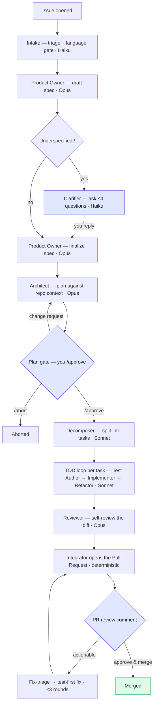

# Tsukinome

A GitHub-native agent that turns a natural-language issue into a high-quality, **test-first
pull request** — installable on any TypeScript repo, with **no per-repo config files**.

Open an issue describing what you want. Tsukinome acknowledges it, drafts a spec (asking
clarifying questions only if it must), proposes a plan for you to approve, then implements it
test-first — writing a failing test, making it pass, one commit per task — and opens a
self-reviewed PR. Every run's cost is measured and capped. The whole thing is reviewable in
GitHub; there's no external dashboard.

## How it works

```
issue ─► acknowledge ─► spec ─►(clarify?)─► plan ─►[you /approve]─► TDD implement ─► review ─► PR
```

The full workflow, with the human gates (highlighted) and the model tier each stage runs on:



The blue nodes are where **you** are in the loop — answering clarifications, approving the plan,
and reviewing the PR. Everything else runs on its own.

- **Clarification gate** (conditional): if the issue is underspecified, Tsukinome asks one
  batched set of questions and waits for your reply.
- **Plan gate** (always): it commits a `plan.md` and waits for `/approve` (or `/abort`, or a
  change request) before writing any code.
- **The PR** is the final gate — review and merge as usual. Comment to request changes and
  Tsukinome runs a bounded, test-first fix loop.

The agents only ever produce structured output; **all git writes go through deterministic
code** (the Integrator) using a least-privilege token. See [`docs/security.md`](docs/security.md).

## Install & run

Tsukinome is a GitHub App backed by a small Node service (Probot + Postgres). Full
step-by-step instructions — creating the App, its permissions and events, provisioning
Postgres + pgvector, and deploying — are in **[`docs/setup.md`](docs/setup.md)**.

Quick version, once the App is created and the environment is set:

```bash
npm install
npm run migrate up        # apply database migrations
npm start                 # serves webhooks + runs the worker in one process
```

Then install the App on a repo and open an issue. **No files need to be added to the target
repo** — Tsukinome stores its spec/plan artifacts on its own working branch.

### Configuration

All configuration is environment variables (no config files). See `docs/setup.md` for the full
list. Notable knobs:

| Variable | Required | Default | Purpose |
| --- | --- | --- | --- |
| `RUN_BUDGET_USD` | no | `1.00` | Per-run model-spend ceiling. A run stops gracefully when it's hit. |
| `PORT` | no | `3000` | HTTP port for the webhook server. |

### Observability

- Each completed run posts a **cost summary** (total + per-role breakdown) in the PR body and
  an issue comment; spend is capped by `RUN_BUDGET_USD`.
- `npm run debug:cost-metrics` prints the **measured average cost per issue** across all runs.

## Developing Tsukinome

This repo is built by **Claude Code**, phase by phase, following `docs/implementation-plan.md`.

- `docs/implementation-plan.md` — the full phased build plan.
- `CLAUDE.md` — the working agreement and locked decisions (auto-loaded each session).
- `PROGRESS.md` — current status, decisions, and log.
- `.claude/commands/` — `/phase-report` helper.

```bash
npm test          # unit tests (gated integration suites skip without their keys/DB)
npm run lint
npm run typecheck
```
